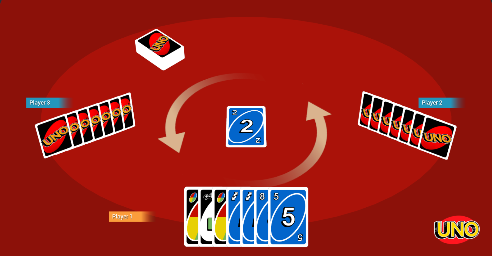

# Uno Party

> A recreation of [UNO](https://store.steampowered.com/app/470220/UNO/) made with the
> [Godot](https://godotengine.org/) engine, for educational purposes.

### Features

- Local multiplayer up to as many players as you want
- All cards of a regular UNO deck
- Infinite deck

### Download

Check out the latest [release](https://github.com/MikeFP/uno-party/releases).

# For devs

## Installing

The game was made in Godot 3.x. You can download it
[here](https://godotengine.org/download/3.x/windows/).

After cloning this repository, to edit the game, open Godot. In the Project Manager window,
import and open the cloned project folder.

## Testing

Even though it's a multiplayer game, the main game scene can be tested without having to connect
players to the lobby, by running the `GameRoom.tscn` scene directly.

Although only your cards will be visible, you can play cards for other players in their
respective turns, by hovering and clicking cards in their hands.

The desired amount of players and other parameters can be configured in the root
`GameController` node.
